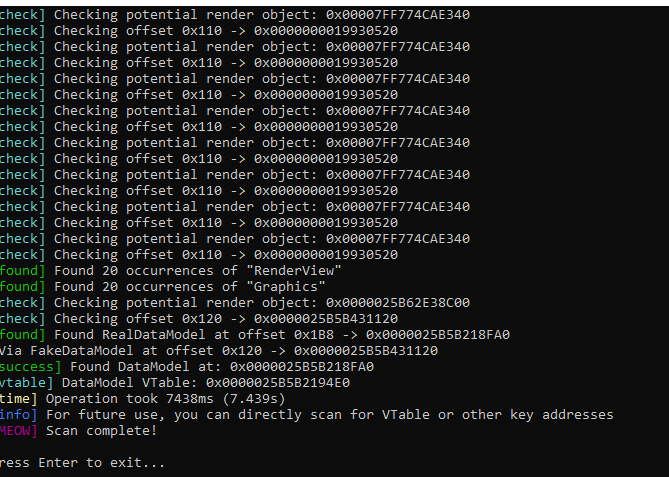

# Roblox Datamodel Dumper

## Method Used

- Fast string pattern scanning for graphics-related identifiers ("Graphics" and "RenderView")
- Direct traversal of pointer chains using known working offsets (FakeDataModel at 0x120, RealDataModel at 0x1B8)
- Targeted memory scanning with reduced search ranges for optimal performance
- Quick validation of found addresses with minimal verification steps

The core approach focuses on:
- Finding the RenderView object through string pattern scanning
- Accessing FakeDataModel at offset 0x120 from RenderView
- Accessing RealDataModel at offset 0x1B8 from FakeDataModel
- Validating the DataModel by checking for expected memory structures

These offsets may need adjustment after major Roblox updates.